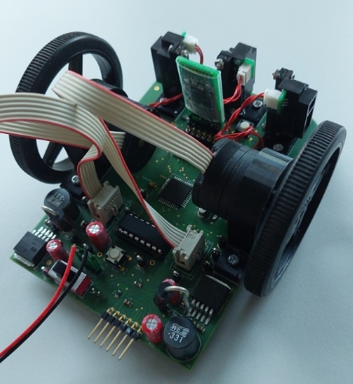
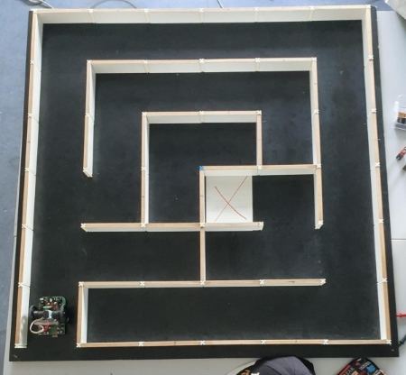
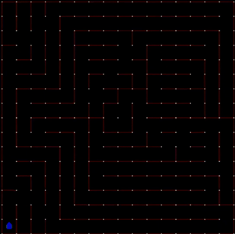

# Micromouse: Designing an Educational Racing - Robot from Scratch [TUM IN2106/IN4235]

A practical course at TU Munich to build a micromouse robot from scratch, led by [Dr. Ph.D. Alexander Lenz](https://www.ce.cit.tum.de/air/people/dr-alexander-lenz/). This repository serves as a collection of code and ressources during our group work of SS22. See the official [course description](https://campus.tum.de/tumonline/wbLv.wbShowLVDetail?pStpSpNr=950367380&pSpracheNr=2) for further information.

Content overview:
- `src/`: Source and header files for the programming of a [Microchip dsPIC33FJ64MC804](https://www.microchip.com/en-us/product/dsPIC33FJ64MC804) microcontroller using the [MPLAB X IDE](https://www.microchip.com/en-us/tools-resources/develop/mplab-x-ide) and the [MPLAB XC16 Compiler](https://www.microchip.com/en-us/tools-resources/develop/mplab-xc-compilers).
- `pcb/`: Schematics and board layout designed in [Autodesk Eagle](https://www.autodesk.com/products/eagle/overview?term=1-YEAR&tab=subscription).
- `cad/`: 3D printed CAD parts including sensor and motor mountings.

## PCB

List of external Eagle libraries:

| Name  | Usage |
|-------|-------|
| [microchip-dspic33fjxxmc](http://eagle.autodesk.com/eagle/libraries?utf8=%E2%9C%93&q%5Btitle_or_author_or_description_cont%5D=dsPIC33FJ64MC&button=) | Microcontroller DSPIC33FJ64MC804 |
| [Eagle_WCAP-ATG5 (rev21a).lbr](https://www.we-online.com/catalog/en/DESIGNKIT_860022) | Electrolytic Capacitors |
| [Eagle_WE-TIS (rev22a).lbr](https://www.we-online.com/catalog/en/WE-TIS) | Inductances |
| [Eagle_WE-XTAL (rev21c).lbr](https://www.we-online.com/catalog/en/WE-XTAL) | Oscillator Quartz Crystal |
| [SamacSys_Parts.lbr](https://github.com/vincent290587/EAGLE/blob/master/SamacSys/SamacSys_Parts.lbr) | Power Switch |
 
## Instructions for high-level maze solver
### 1) Allocate heap memory.
With the microchip compiler you have to allocate heap memory in the project properties ([tutorial from Microchip](https://microchipdeveloper.com/mplabx:creating-a-heap)). Use for example 4096 bytes.
### 2) If necesarry, adapt the settings of the high-level maze solver in `src/settings.h`.
- MAZE_SIZE: Number of columns (= number of rows) of maze.
- SIMULATION: Defines if simulation or real robot is used (used simulation: [mms by mackorone](https://github.com/mackorone/mms)).
- VISUALIZATION: Defines if in simulation visualization should be used.
### 3) Only if you use the simulation: Rename main files.
Rename `main.c` to `main_not_used.c` (or any other name) and rename `main_simulation.c` to `main.c`.
### 4) Start high-level maze solver.
- For simulation: Compile code and then follow the instructions of [mms by mackorone](https://github.com/mackorone/mms).
- For real-world Micromouse: Flash the compiled code onto the Micromouse robot and put the Micromouse into the starting position (bottom left corner of the maze, i.e. you have to place the mouse in one of the corners such that there is an outer wall of the maze on the left side of the mouse). Then turn the Micromouse on. After 10 seconds, it will automatically start exploring. After the exploration phase, it calculates and executes the shortest path from the starting cell to the center of the maze.

## Some impressions
Finished Micromouse:  
  

6 x 6 maze to test the Micromouse:  
  

Testing the high-level maze solver in simulation:  
  